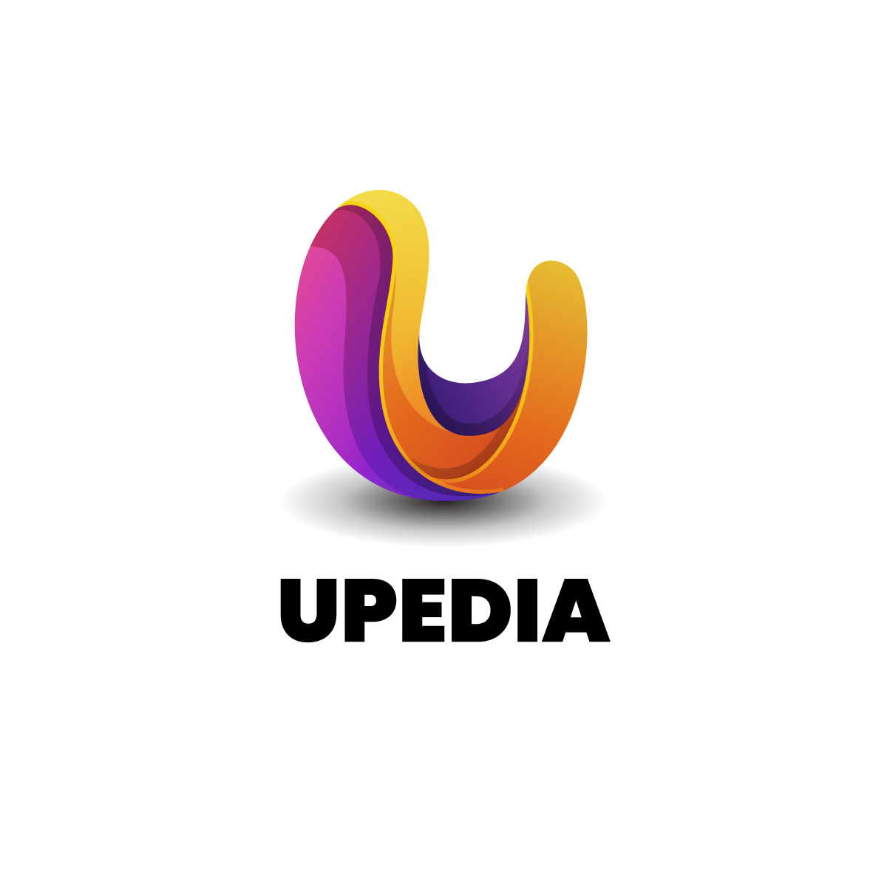
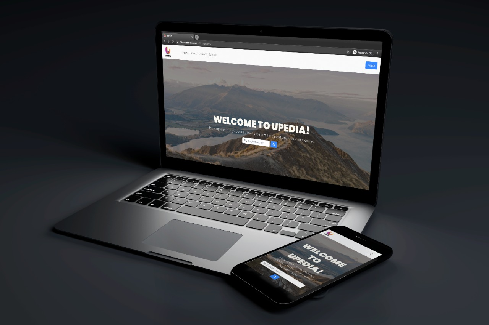
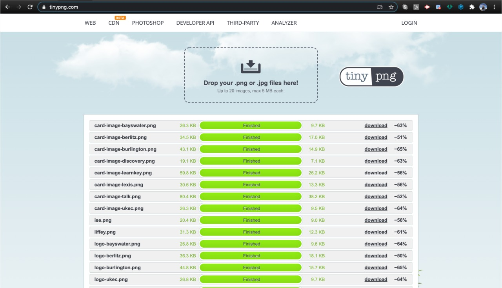
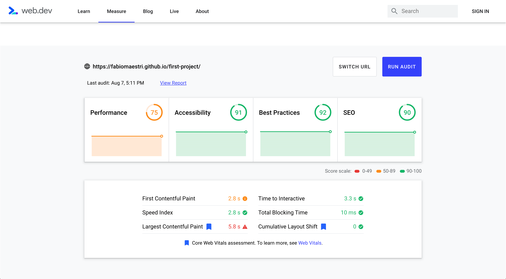

  

# Description

*This is a fictitious company*

> UPEDIA is school platform which provide numerous options to our students! We especialize in education and provide a wide array of services in many countries
> We have developed a business from the ground up which has been serving our learners for over 10 years and has won several awards like the 

**International student education** Award which takes place in London.

# Deployment and Demo
Website has been deployed to [GitHub Pages](https://github.com/Fabiomaestri/first-project).

# Wireframe
The wireframe was designed using [Wireframe](https://wireframe.cc/) and links to the final version can be found below:
- [Wireframe Final Version]()

# UX
I have opted to a simple and responsive design which is lightweight and has a loading time of less than 1 second.
- Home page: Contains a jumbotron and a background image for the main section which resizes accordingly depending on user's viewport size
- About us page: Contains a fixed image in the main section and a set of card elements at the bottom section for the philosophy of the company
- Schools page: Contains a jumbotron and a background image for the main section which resizes accordingly depending on user's viewport size. Contains a school section bellow, with cards design responsevely, users can have great experience with modern and light style. We also add a filter where users can personalize their search and improve the UX.
- School profile page: Contain complete information of the school, we decided acordingly with ux to add a menu in the bottom to give users precise navigation, during their experience. We only use basic code but it is well design to show all services they have in just one place.
- contact page: Contact page contains a contact form in basic style.

In order to improve user experience and website loading speed, I have compressed the images using [tinypng.com](https://tinypng.com/) and the reduction in image size has been 57%.

# Visual Identity
- [Freepick](https://www.freepik.com/) for the logo design and stationary
- [Fontawesome](https://bootswatch.com/) Icons to add extra sweetness

# User Stories
Users:
- As a user, I'd like to buy a language course
- As a user, I'd like to contact the company to help me with visa process
- As a user, I'd like to see who are the leaders of the company
- As a user, I'd like to sign up as students download documents
Partners:
- As a partner, I'd like to list my services in the site
- As a partner, I'd like to receive legal advice on certain issues
- As a partner, I'd like to access the members area
- As a partner, I'd like to connect with potencial clients
- As a partner, I'd like to rec recieve clients from website
- As a partner, I'd like to see insights, web traffic and inquires

# Testing
Website has been tested using [Web Dev](https://web.dev/), see results below:

The points below can be improved with a bit more optimization:
- Serving scaled images (some images are being resized in CSS e.g. logo.png)
- Leveraging browser caching

# Scalability
Using a back-end programming language and database, I'd like to have a fully featured CMS which can be used by non-technical people to create, read, update and delete data easily.
Also, I'd like to have a private section where partners can find resources and talk directly to our customer service representatives.

# Technologies
- [Bootstrap](https://getbootstrap.com/)
- [jQuery](https://jquery.com/)

# Media
I have used different resources for images and my logo, I'll list all below:
- [Freepick](https://www.freepik.com/) for the logo design and stationary
- [Freepick](https://www.freepik.com/) for all the images
- [Font Awesome](https://fontawesome.com/6?next=%2Fstart) for the amazing icons used on this site

# Thanks to
- Font awesome community for developing this great resource
- Bootstrap crew for developing and maintaining such great library
- jQuery developers for all the work and great documentation
- Freepick for the great service
- Gitpod for developing VScode and providing it free of charge

# License
This project is licensed under the [MIT](https://choosealicense.com/licenses/mit/) license.
Copyright 2020 Felipe Souza Alarcon.
Permission is hereby granted, free of charge, to any person obtaining a copy of this software and associated documentation files (the "Software"), to deal in the Software without restriction, including without limitation the rights to use, copy, modify, merge, publish, distribute, sublicense, and/or sell copies of the Software, and to permit persons to whom the Software is furnished to do so, subject to the following conditions:
The above copyright notice and this permission notice shall be included in all copies or substantial portions of the Software.

THE SOFTWARE IS PROVIDED "AS IS", WITHOUT WARRANTY OF ANY KIND, EXPRESS OR IMPLIED, INCLUDING BUT NOT LIMITED TO THE WARRANTIES OF MERCHANTABILITY, FITNESS FOR A PARTICULAR PURPOSE AND NONINFRINGEMENT. IN NO EVENT SHALL THE AUTHORS OR COPYRIGHT HOLDERS BE LIABLE FOR ANY CLAIM, DAMAGES OR OTHER LIABILITY, WHETHER IN AN ACTION OF CONTRACT, TORT OR OTHERWISE, ARISING FROM, OUT OF OR IN CONNECTION WITH THE SOFTWARE OR THE USE OR OTHER DEALINGS IN THE SOFTWARE.